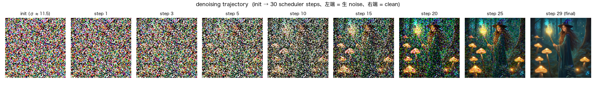
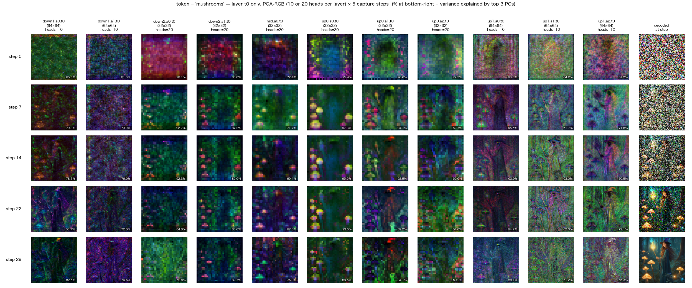

# diffusers_probe

Diffusers を用いた画像生成モデル内部の観察・可視化のための調査



**Figure 1**: SDXL Base 1.0 の denoising 生成過程（**左 → 右**）。純粋なノイズ（左端）から拡散の 30 ステップを経て画像（右端）へ。各パネルは手動 scheduler ループ途中の latent を VAE で画像に戻したもの。図はノート [02_sdxl_base_inside.ipynb](lecture/02_sdxl_base_inside.ipynb) の §6 で生成。



**Figure 2**: SDXL Base 1.0 の cross-attention probe（単語 'mushrooms' への注目）。**縦（上 → 下）が denoising の生成過程**（step 0 のノイズ → step 29 の完成）、**横（左 → 右）は UNet の各 cross-attention 層**（down → mid → up、最右列は各 step で decode した画像）。各セルは 'mushrooms' への attention を PCA で RGB 3 色に落として可視化したもの。図はノート [02_sdxl_base_inside.ipynb](lecture/02_sdxl_base_inside.ipynb) の §7 で生成。

## Purpose

Hugging Face Diffusers の既存 API と、必要に応じた軽い PyTorch hook を使って、潜在拡散モデル（Latent Diffusion Model）の内部計算（text encoder / UNet / cross-attention / scheduler / VAE など）を観察・可視化するための probe workspace。
主成果物は `lecture/` 配下の Jupyter Notebook 群で、各ノートは単体で完結する設計。
`scripts/` はその前段・周辺で行った調査スクリプト群、`docs/` には実験レポート md が置かれている。
Diffusers のソースコードは改変せず、pip install 版を使う。

## Models

lecture ノートで扱う主対象:

- `stable-diffusion-v1-5/stable-diffusion-v1-5`（SD1.5、nb00）
- `stabilityai/stable-diffusion-xl-base-1.0`（SDXL Base、nb01 / nb02）

`scripts/` で動作確認済みのモデル（下記 Advanced 参照）:

- SDXL Turbo / FLUX.1-schnell / SD3.5 Medium / Qwen-Image / SDXL-Lightning・Animagine XL 等の LoRA 派生

## Repository structure

主な公開物は `lecture/`（ノート本編）と `rendered/`（output 込みの実行済み版）。ほかに `scripts/`（probe / 生成スクリプト）・`docs/`（実験レポート md + `docs/images/`）・`images/`（README 図）。

作業用の gitignore ディレクトリ（`outputs/ runs/ notes/ scratch/ inbox/ tmp/`）を含む全ディレクトリの役割・保存期間、および作業方針は [CLAUDE.md](CLAUDE.md) の「フォルダ役割定義」を参照。

---

## Notebooks

`aidemo2026` venv で動作。各ノートは外部 script に依存せず単体で実行できる。実行前のノートの他に、実行済み版と Colab で実行できるリンクを付けてある。Colab 実行する場合、GPU が要るノートは「ランタイムのタイプを変更」で選択する。

- **[00_sd15_intro.ipynb](lecture/00_sd15_intro.ipynb)**
  Stable Diffusion 1.5 を動かしながら潜在拡散モデルの基本を体験する。環境確認 → モデル読み込み → 画像生成 → pipeline（text encoder / UNet / VAE / scheduler）の観察 → tokenizer → seed / steps の sweep → SD1.5 系 FT モデル。

  [実行結果を見る](rendered/00_sd15_intro.ipynb)・[](https://colab.research.google.com/github/shimosan/diffusers_probe/blob/main/lecture/00_sd15_intro.ipynb)（GPU・無料 T4 可 / CPU でも可）

- **[01_sdxl_base_intro.ipynb](lecture/01_sdxl_base_intro.ipynb)**
  00 とほぼ同じ手順を SDXL Base 1.0 で繰り返し、SD1.5 との違いを見比べる。1〜7 章で基本構造、8〜10 章で SDXL 系派生（SDXL Lightning 蒸留 / Animagine XL / style LoRA stacking）。

  [実行結果を見る](rendered/01_sdxl_base_intro.ipynb)・[](https://colab.research.google.com/github/shimosan/diffusers_probe/blob/main/lecture/01_sdxl_base_intro.ipynb)（GPU・**無料 T4 不可、L4 推奨**）

- **[02_sdxl_base_inside.ipynb](lecture/02_sdxl_base_inside.ipynb)**
  SDXL Base の内部処理を「実物のコードの中身を開いて」見る。tokenize → text encode → prompt embedding の地形図（PCA / t-SNE）→ 手動 scheduler ループ → cross-attention probe → guidance scale と negative prompt → VAE roundtrip。3 年前（2023）の SD1.5 デモの cross-attention 可視化を SDXL Base で組み直したもの。

  [実行結果を見る](rendered/02_sdxl_base_inside.ipynb)・[](https://colab.research.google.com/github/shimosan/diffusers_probe/blob/main/lecture/02_sdxl_base_inside.ipynb)（実行 Mac M4 Max ~12 分 / Windows・Colab L4 ~3 分・初回 DL ~7GB(fp16)〜14GB(fp32)・ローカルは メモリ 64GB 以上、**Colab は無料 T4 不可・L4 推奨**）

---

## Setup（notebook 用）

`aidemo2026` venv（**Python 3.12 系を使用。手元の基準は 3.12.10**）を作成し、必要なパッケージを入れる。qwen3_4b_probe と共通の統合環境で、この `requirements.txt` 1 個で Mac / Windows / GPU の有無どれでも入る:

```bash
# Python は 3.12 系を使う（基準 3.12.10）。まず `python3 --version` で確認:
#  A) 3.12 系ならそのまま下の `python3 -m venv ...` を実行する。
#  B) 3.12.10 に厳密に揃えたいなら pyenv で入れ、その python で venv を作る:
#       pyenv install 3.12.10
#       ~/.pyenv/versions/3.12.10/bin/python -m venv ~/.venvs/aidemo2026
python3 -m venv ~/.venvs/aidemo2026
source ~/.venvs/aidemo2026/bin/activate
pip install -U pip wheel
# torch は OS/GPU で入れ方が違うので先に入れる（版は固定しない）:
pip install torch torchvision                 # Mac (Apple Silicon) / GPU 無し(CPU)
# NVIDIA GPU (CUDA 12.8) の場合: pip install torch torchvision --index-url https://download.pytorch.org/whl/cu128
pip install -r requirements.txt
```

モデルは各ノートの初回実行時に Hugging Face cache へダウンロードされる（SD1.5 ~5GB / SDXL Base は fp16 で ~7GB・fp32 で ~14GB）。後続の起動時は cache から読み出される。

> **Colab で動かす場合はこの setup は不要**です。torch 等は最初から入っており、各ノート冒頭の「環境セットアップ」セルが Colab を自動判定して必要分だけ `!pip install` します。ノートを開いて「ランタイム → すべて実行」するだけです。

> **補足**: activate 後にプロンプトが `((aidemo2026) )` と二重括弧になる場合、`python3 scripts/fix_venv_prompt.py ~/.venvs/aidemo2026` で単一括弧に直せます（見た目だけの問題で動作には無影響）。使い方や仕組みはスクリプト冒頭のコメント参照。

## Notebook の開き方

setup 完了後、`aidemo2026` venv を activate して Jupyter を起動するか、VS Code / Cursor で `.ipynb` を直接開く。

### 方法 A — Jupyter Lab

```bash
source ~/.venvs/aidemo2026/bin/activate
cd lecture
jupyter lab
```

カーネルは起動した `aidemo2026` venv の Python（汎用の `python3` カーネル）がそのまま使われる。

### 方法 B — VS Code / Cursor

`.ipynb` を直接開けば Jupyter 拡張が起動する。右上の「カーネル選択」から `aidemo2026`（`~/.venvs/aidemo2026/bin/python`）を選択。

### 初回実行時の注意

- 最初のセル（model load）は数十秒〜数分かかる（モデルを RAM に展開するため）。
- Mac (M シリーズ) では MPS が自動で選ばれる。CUDA 環境では CUDA。何も使えなければ CPU fallback。
- ノートの kernelspec は汎用の `python3` を指しているので特別なカーネル登録は不要。VS Code / Cursor では `aidemo2026` venv の Python を、Jupyter Lab では起動した venv を選べばそのまま動く（Colab は無関係）。

---

# Advanced — scripts と experiment reports

ここから下は、lecture の前段・周辺で実施した調査スクリプトおよび実験レポートに関する情報。**ノートを動かすだけなら不要**で、内部の経緯や個別実験の詳細を追いたい人向け。

## Scripts

`scripts/` は SD1.5 から複数の潜在拡散モデルへ段階的に対象を広げた probe / 生成スクリプト群。

| # | Script | 内容 |
|---|---|---|
| 00 | [00_env_check.py](scripts/00_env_check.py) | 環境（torch / diffusers / MPS）の確認 |
| 01 | [01_sd15_generate_smoke.py](scripts/01_sd15_generate_smoke.py) | SD1.5 smoke（fp32 + safety_checker ON、ハードコード）|
| 02 | [02_sd15_generate.py](scripts/02_sd15_generate.py) | SD1.5（fp16/fp32、config 駆動）|
| 03 | [03_sdxl_base_generate.py](scripts/03_sdxl_base_generate.py) | SDXL Base 1.0 |
| 04 | [04_sdxl_turbo_generate.py](scripts/04_sdxl_turbo_generate.py) | SDXL Turbo |
| 05 | [05_flux1_schnell_generate.py](scripts/05_flux1_schnell_generate.py) | FLUX.1-schnell |
| 06 | [06_sd35_medium_generate.py](scripts/06_sd35_medium_generate.py) | SD3.5 Medium |
| 07 | [07_qwen_image_generate.py](scripts/07_qwen_image_generate.py) | Qwen-Image |
| 08 | [08_sdxl_base_deep_probe.py](scripts/08_sdxl_base_deep_probe.py) | SDXL Base の deep probe（legacy-style cross-attention grid）|
| 09 | [09_prompt_explore.py](scripts/09_prompt_explore.py) | SDXL Base の prompt 探索（config 駆動）|
| 10 | [10_quickgen.py](scripts/10_quickgen.py) | 汎用 quickgen（`--models` × `--prompt-sets` で組み合わせ実行 + grid PNG）|

`10_quickgen.py` は 01–07 を統合した汎用版で、`scripts/model_sets.json` と `scripts/prompt_sets.json` を読み、`AutoPipelineForText2Image` を第一選択に複数モデル × 複数 prompt を回す。model entry で LoRA stacking と scheduler 差し替えをサポートする。

各 script の詳細は冒頭の docstring を、パラメータ schema は [CLAUDE.md](CLAUDE.md) を参照。

### Setup（scripts 用）

scripts / 実験用の dev venv は `dfs2026-dev` を使う（notebook 用 `aidemo2026` に lint / type-check 等の dev tool を足したもの）:

```bash
python3 -m venv ~/.venvs/dfs2026-dev
source ~/.venvs/dfs2026-dev/bin/activate
pip install -U pip wheel
pip install -r requirements-dev.txt
```

### Scripts の使い方

```bash
source ~/.venvs/dfs2026-dev/bin/activate
python scripts/00_env_check.py
python scripts/02_sd15_generate.py
python scripts/10_quickgen.py --models sd15,sdxl_base --prompt-sets witch --list
```

## Documentation map

実験レポート md は `docs/` 配下にある。**GitHub** または **`Cmd+Shift+V`（VS Code / Cursor の Markdown Preview）** で読むのが見やすい（KaTeX 数式が render される）。

- [docs/00-07_models_and_outputs.md](docs/00-07_models_and_outputs.md) — scripts 00–07 のモデル一覧・出力・参考文献をまとめた総合レポート
- [docs/00b_sd15_mps_fp16_probe.ipynb](docs/00b_sd15_mps_fp16_probe.ipynb) — SD1.5 の MPS + fp16 での黒画像問題の切り分け（真因は attention slicing × safety_checker）
- [docs/01b_sdxl_base_mps_fp16_probe.ipynb](docs/01b_sdxl_base_mps_fp16_probe.ipynb) — SDXL Base の MPS + fp16 検証

## Notebook を編集して commit する場合（開発者向け）

ノートを動かすだけなら不要だが、`.ipynb` に変更を加えて git commit する人は、**clone 直後に 1 回**以下を実行する:

```bash
source ~/.venvs/aidemo2026/bin/activate
nbstripout --install --keep-id
```

これは `.git/config` に notebook 用 filter を登録し、`*.ipynb` の output セルを commit 時に自動除去する設定（`--keep-id` はセル UUID を保持）。設定しないと出力付きノートをそのまま commit してリポジトリが肥大化する。

## Notes

- このリポジトリでは Diffusers のソースコードを改変しない（pip install 版を使う）。source-level の tracing / 改変が必要な場合は別の workspace（editable install）を使う。
- モデル重みは Hugging Face cache に置き、workspace 内には保存しない。

## 謝辞

本 workspace は以下の open-source プロジェクトと公開モデルに依拠している（各モデルの利用条件は各モデルカードのライセンスを参照）:

- **[Diffusers](https://github.com/huggingface/diffusers)** (Hugging Face / Apache-2.0) — pipeline API、scheduler、attention processor、VAE 等
- **[Transformers](https://github.com/huggingface/transformers)** (Hugging Face / Apache-2.0) — CLIP text encoder / tokenizer
- **[Stable Diffusion 1.5](https://huggingface.co/stable-diffusion-v1-5/stable-diffusion-v1-5)**（CreativeML Open RAIL-M）— nb00 の主対象
- **[SDXL Base 1.0](https://huggingface.co/stabilityai/stable-diffusion-xl-base-1.0)**（Stability AI）— nb01 / nb02 の主対象
- **[SDXL Turbo](https://huggingface.co/stabilityai/sdxl-turbo)** / **[FLUX.1-schnell](https://huggingface.co/black-forest-labs/FLUX.1-schnell)** / **[Stable Diffusion 3.5 Medium](https://huggingface.co/stabilityai/stable-diffusion-3.5-medium)** / **[Qwen-Image](https://huggingface.co/Qwen/Qwen-Image)** — scripts の対象モデル
- **[SDXL-Lightning](https://huggingface.co/ByteDance/SDXL-Lightning)**（ByteDance）/ **[Animagine XL 3.1](https://huggingface.co/cagliostrolab/animagine-xl-3.1)** 等 — nb01 の LoRA / FT 派生例
- **[PEFT](https://github.com/huggingface/peft)** (Hugging Face / Apache-2.0) — LoRA 適用
- **matplotlib / scikit-learn / NumPy / Pillow** — 可視化・数値処理

本 repository 自体は MIT License（[LICENSE](LICENSE)）で公開している。
