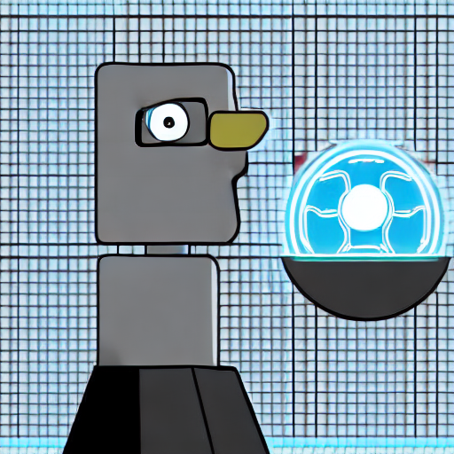
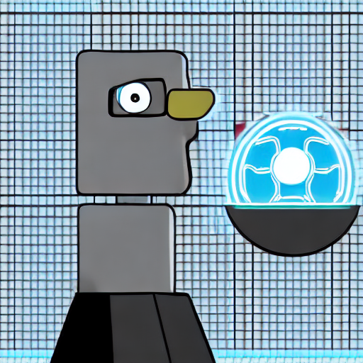

# 画像生成モデル比較 — scripts 00–07

Scripts:
- [`scripts/00_env_check.py`](../scripts/00_env_check.py)
- [`scripts/01_sd15_generate_smoke.py`](../scripts/01_sd15_generate_smoke.py)
- [`scripts/02_sd15_generate.py`](../scripts/02_sd15_generate.py)
- [`scripts/03_sdxl_base_generate.py`](../scripts/03_sdxl_base_generate.py)
- [`scripts/04_sdxl_turbo_generate.py`](../scripts/04_sdxl_turbo_generate.py)
- [`scripts/05_flux1_schnell_generate.py`](../scripts/05_flux1_schnell_generate.py)
- [`scripts/06_sd35_medium_generate.py`](../scripts/06_sd35_medium_generate.py)
- [`scripts/07_qwen_image_generate.py`](../scripts/07_qwen_image_generate.py)

最終更新: 2026-05-23
ステータス: 🟢 全 7 script 動作確認済み。AC 駆動・cache warmed の clean run で timing を確定。

---

## 1. このドキュメントの位置づけ

このリポジトリ ([diffusers_probe](../README.md)) は、Hugging Face Diffusers で **画像生成モデルの内部を観察する** ことが最終目的です。最初のステップとして、**主要 6 モデルを Mac (M4 Max, **MPS** = Metal Performance Shaders、Apple Silicon の GPU バックエンド) で実際に動かしてみて、どれが講義デモに使えるか**を見極めるのが本ドキュメントの内容です。

| script | モデル | 役割 |
|---|---|---|
| 00 | (なし) | 環境チェック |
| 01 | **SD1.5** = Stable Diffusion 1.5 | smoke test (超安全策、ハードコード) |
| 02 | SD1.5 | 標準生成 (1024 fp32 + 512 fp16 の 2 pass) |
| 03 | **SDXL** Base 1.0 = Stable Diffusion XL | 標準生成 |
| 04 | SDXL Turbo | 4-step 高速生成 |
| 05 | FLUX.1-schnell | 4-step 高速生成 (**HF** = Hugging Face gated) |
| 06 | **SD3.5** Medium = Stable Diffusion 3.5 | 標準生成 (HF gated) |
| 07 | Qwen-Image | 20B モデル、テキスト描画特化 |

略語の凡例 (本文中の初出時にも展開):
- **fp16 / fp32 / bf16**: それぞれ floating-point 16-bit / 32-bit / brain-float 16-bit (Google が深層学習用に提案した変種、fp16 と同じ 16 bit だが指数部を広げて表現範囲を確保)
- **VAE** = Variational Autoencoder (画素 ↔ latent 空間の符号化器)
- **UNet** = U-shaped neural network (encoder-decoder + skip connection、SD1.5/SDXL の denoising 中核)
- **CLIP** = Contrastive Language-Image Pretraining (OpenAI のテキスト-画像 alignment encoder)
- **CFG** = Classifier-Free Guidance (条件付け強度を強める手法)
- **MMDiT** = Multi-Modal Diffusion Transformer (FLUX/SD3.5/Qwen の新型 backbone)
- **ADD** = Adversarial Diffusion Distillation (SDXL Turbo の蒸留手法)
- **DDPM** = Denoising Diffusion Probabilistic Models (Ho+ 2020、SD1.5/SDXL が依拠する古典的**拡散モデル**)
- **Rectified Flow** = 直線補間経路の **flow matching** 手法 (Liu+ 2022、FLUX / SD3.5 が公式に採用)。Qwen-Image は diffusers 実装で `FlowMatchEulerDiscreteScheduler` を使う MMDiT / flow-matching 系。**DDPM とは数学的に別ファミリ** (Markov 拡散過程ではなく決定論的 flow)、ただし「ノイズから反復で生成」という運用面の見た目は似ているためコミュニティでは "diffusion-based" と総称されがち
- **VLM** = Vision Language Model (画像とテキストを同時に扱う LLM、例: Qwen2.5-VL)
- **HF gated**: モデルが Hugging Face 上で「利用条件 (license terms) への承認」を要求している状態。初回 download 前に該当 model の HF ページで Accept ボタンを押し、`hf auth login` でトークン認証を済ませる必要がある。本ドキュメント内では FLUX.1-schnell と SD3.5 Medium が該当。

実行順は 00 → 01 → 02 → 03 → 04 → 05 → 06 → 07。各 script は独立しています (script 間の出力連携はなし)。

> **note**: 本ドキュメントの数値・画像は 2026-05-23 の **clean run** スナップショットに基づきます (`runs/2026-05-23_clean/`)。条件:
> - **2 回目の実行**なので HF cache warmed (download 時間は load_time に含まれない)
> - AC 駆動・`caffeinate -i` 付きで idle sleep 抑制・他重 process なし
> - 全 7 script を順次実行、合計 24m15s

---

## 2. 全 scripts の共通設定

設定は [`scripts/diffusers_probe.json`](../scripts/diffusers_probe.json) に集約。

```json
{
  "common": {
    "prompt": "A small robot studying artificial intelligence in a university classroom, simple illustration",
    "negative_prompt": "blurry, low quality, distorted",
    "seed": 42,
    "width": 1024,
    "height": 1024
  },
  "models": {
    "sd15":         { "steps": 20, "guidance_scale": 7.5, "mps_dtype": "float32", ... },
    "sdxl_base":    { "steps": 30, "guidance_scale": 7.5, "mps_dtype": "float32", ... },
    "sdxl_turbo":   { "steps":  4, "guidance_scale": 0.0, "mps_dtype": "float32", ... },
    "flux_schnell": { "steps":  4, "guidance_scale": 0.0, "mps_dtype": "bfloat16", ... },
    "sd35_medium":  { "steps": 28, "guidance_scale": 4.5, "mps_dtype": "bfloat16", ... },
    "qwen_image":   { "steps": 30, "guidance_scale": 4.0, "mps_dtype": "bfloat16", ... }
  }
}
```

ポイント:

- **prompt / negative_prompt / seed / 解像度 (1024x1024) は全モデル共通**。比較条件を揃えるのが目的。
- **steps / guidance はモデル固有**: SDXL Turbo と FLUX.1-schnell は distilled モデルで 1-4 step が前提、**CFG (Classifier-Free Guidance、条件付け強度を強める手法)** も 0 が前提。SD3.5 は 4.5、Qwen は 4.0 など、モデルが想定する値を尊重。
- **dtype は MPS 上の実測で決定**: 今回の検証環境 (M4 Max + torch 2.12.0 + diffusers 0.38.0) では、SDXL 系は MPS で fp16/bf16 が **NaN** (Not a Number、無効値) になったため fp32。FLUX / SD3.5 / Qwen は bf16 で安定動作。詳細は各 Chapter で説明。

共通ユーティリティは [`scripts/common.py`](../scripts/common.py) にあり、主に以下を提供:

- `load_config()` / `get_common()` / `get_model_config(key)` — config 読み込み
- `pick_device_and_dtype(model_cfg)` — **CUDA** (NVIDIA GPU) / **MPS** / cpu 自動選択 + dtype 解決
- `apply_vae_fp32_override(pipe)` — **VAE (Variational Autoencoder)** のみ fp32 化 (一部モデルで必要)
- `build_summary_base(...)` / `write_outputs(...)` — 02–07 で統一フォーマットの png + summary.json + .txt を保存
- `hint_for_load_error(exc, model_id)` — gated repo / OOM / 接続エラーのヒント抽出

---

## 3. Chapter 00 — 環境確認 ([`00_env_check.py`](../scripts/00_env_check.py))

### 目的

Python / 主要 package / device (MPS/CUDA) / venv / config を 1 画面で確認するだけ。**モデルのロードは行わない** (重い処理は起動チェックに混ぜない CLAUDE.md 方針)。

### 実装の要点

`importlib.import_module(name)` で torch / diffusers / transformers / accelerate / huggingface_hub / safetensors / PIL / matplotlib / pandas を列挙、未インストールでも止まらず "not installed" と表示。`torch.cuda.is_available()` / `torch.backends.mps.is_available()` で device 確認。

### 結果

初回計測時の環境:

```text
python  : 3.12.13
platform: macOS-26.3.1-arm64-arm-64bit
torch   : 2.12.0
diffusers   : 0.38.0
transformers: 5.9.0
mps available: True
cuda available: False
venv: ~/.venvs/dfs2026-dev
```

→ MacBook Pro 16 (M4 Max, 64GB) の MPS 環境。以降の script はすべてこの環境で実行。

---

## 4. Chapter 01 — SD1.5 smoke test ([`01_sd15_generate_smoke.py`](../scripts/01_sd15_generate_smoke.py))

### 目的

**「Diffusers が壊れずに動くこと」の最初の確認**。dtype / safety_checker / 解像度 / steps / guidance をすべて **コード中にハードコード** して、迷わず動かす。

### 実装の要点

```python
HARDCODED_MODEL_ID = "stable-diffusion-v1-5/stable-diffusion-v1-5"
HARDCODED_WIDTH = HARDCODED_HEIGHT = 512
HARDCODED_NUM_INFERENCE_STEPS = 20
HARDCODED_GUIDANCE_SCALE = 7.5

def pick_device_and_dtype():
    if torch.cuda.is_available():
        return "cuda", torch.float16
    if torch.backends.mps.is_available():
        return "mps", torch.float32      # MPS は fp32
    return "cpu", torch.float32
```

- **MPS で fp32 を採用**: SD1.5 を MPS + fp16 で動かすと `safety_checker` (**CLIP** = Contrastive Language-Image Pretraining ベース) が誤発火して黒画像を返すことが多いため。fp32 なら safety_checker を温存できる。
- **`enable_attention_slicing()`** を MPS のみで有効化 (メモリ節約)。
- config からは `common.{prompt, negative_prompt, seed}` のみ読み、models セクションは読まない。

### 結果

| 項目 | 値 |
|---|---|
| device / dtype | mps / float32 |
| size | 512×512 |
| steps / guidance | 20 / 7.5 |
| load 時間 (cache hit) | **1.58 s** |
| generation 時間 | **5.19 s** |
| safety_checker | ON |



**Figure 1**: 01 smoke (SD1.5, 512×512, fp32, safety_checker ON) の出力。

→ 期待通り 1 体のロボットが教室で勉強する絵が出る。safety_checker が誤発火する場合はここで黒画像になる (今回は問題なし)。**「とにかく動くこと」がここで保証**できたので、以降の 02–07 では条件を変えて比較してよい状態に。

### 出力ファイル

- [runs/2026-05-23_clean/sd15_generate_smoke.png](../runs/2026-05-23_clean/sd15_generate_smoke.png) (退避保存)
- `outputs/sd15_generate_smoke.{png,_summary.json,.txt}`

---

## 5. Chapter 02 — SD1.5 標準生成 (2-pass) ([`02_sd15_generate.py`](../scripts/02_sd15_generate.py))

### このモデルが特殊な理由

**SD1.5 は 512×512 で訓練されたモデル**。他のモデル (SDXL 以降) は 1024×1024 ネイティブで、揃った解像度で比較できない問題があります。

このリポジトリでは「全モデル 1024×1024 で並べる」方針を採ったため、SD1.5 だけは **2 パス** で生成して両方残すことにしました:

- **Pass A**: 1024×1024 / fp32 (他モデルと並べる比較用)
- **Pass B**:  512×512 / fp16 (本来の SD1.5 の品質)

### 1024×1024 で fp32 が必須な理由

実は最初 1024 fp16 で動かしたところ、画像は**真っ黒**になりました。`vae_fp32_override` で VAE だけ fp32 にしても黒のまま。**UNet (U-shaped neural network、SD1.5/SDXL の denoising 中核ネットワーク)** 段階で latent が NaN になっており、SD1.5 を MPS fp16 で 1024 解像度に動かすこと自体が破綻します。fp32 全体化で回避できますが、SD1.5 の本来想定外サイズなので、構図そのものは破綻します (下記)。

### 結果 — Pass A: 1024×1024 fp32

| 項目 | 値 |
|---|---|
| device / dtype | mps / float32 |
| size | 1024×1024 |
| steps / guidance | 20 / 7.5 |
| load 時間 | 3.22 s |
| generation 時間 | **49.84 s** |


**Figure 2**: SD1.5, 1024×1024, fp32。**複数のロボットが画面いっぱいに並ぶ構図破綻**。これは SD1.5 が 512 で訓練されているために起こる典型的な現象で、講義的には**「訓練解像度から外れるとモデルが破綻する」**ことを示す良い反例素材になります。

### 結果 — Pass B: 512×512 fp16

| 項目 | 値 |
|---|---|
| device / dtype | mps / float16 |
| size | 512×512 |
| steps / guidance | 20 / 7.5 |
| load 時間 | 3.24 s |
| generation 時間 | **4.36 s** |



**Figure 3**: SD1.5, 512×512, fp16, safety_checker 無効。ネイティブ解像度。1 体のロボットが机に座る、SD1.5 本来の絵に。Pass A と全く同じ prompt / seed で出ているのに構図がまったく違うのが本質。

### 観察

1. **解像度がモデル品質を支配する場面がある**: 同じ seed・同じ prompt でも、SD1.5 が訓練されていない 1024 に拡張するだけで破綻する。これは scheduler や guidance 等のパラメータをいじっても解決しない。
2. **fp16 vs fp32 の選択**: SD1.5 は 512 なら fp16 で十分速い (4.36s vs 49.84s で **10 倍以上の差**)。fp32 は「本来の解像度から外れている = 構図がもう破綻している」ケースの救済にしか使えない。

### 講義での扱い

- **本命は Pass B (512×512)**: SD1.5 が想定する条件。
- **Pass A は教材として残す**: 「モデルを訓練解像度外で使うと壊れる」の例。

### 出力ファイル

- [runs/2026-05-23_clean/sd15_generate_1024_fp32.png](../runs/2026-05-23_clean/sd15_generate_1024_fp32.png) (Pass A)
- [runs/2026-05-23_clean/sd15_generate_512_fp16.png](../runs/2026-05-23_clean/sd15_generate_512_fp16.png) (Pass B)

---

## 6. Chapter 03 — SDXL Base 1.0 ([`03_sdxl_base_generate.py`](../scripts/03_sdxl_base_generate.py))

### 背景: SDXL とは

**SDXL = Stable Diffusion XL**。Stability AI が 2023 年に公開した、SD1.5 の正統な後継。UNet を **SD1.5 の約 3 倍に大型化** (約 **2.6B** parameters)、text encoder を 2 本構成 (**CLIP ViT-L + OpenCLIP ViT-bigG**、計 **817M** parameters) にし、**ネイティブ 1024×1024** で訓練 ([Podell et al. 2023](https://arxiv.org/abs/2307.01952))。プロンプト追随性と画質が大きく向上。

### 今回の MPS 環境で fp16 / bf16 を試した結果

最初の試行で次の道筋を辿りました:

1. **fp16 + `vae_fp32_override`** → `Input type (float) and bias type (c10::Half)` RuntimeError。SDXL pipeline 自身が `upcast_vae()` を呼ぶので、自前で VAE を fp32 化する hack と干渉。
2. **fp16 のみ、override 無し** → エラーは出ないが**画像が真っ黒** (UNet 段階で NaN)。
3. **bf16 + `variant="fp16"`** → やはり真っ黒。
4. **mps_dtype = `float32`** → ✅ 成功。

→ **本資料の検証環境** (M4 Max + torch 2.12.0 + diffusers 0.38.0) では、SDXL UNet を fp16 / bf16 で実行すると数値精度問題で NaN になり、fp32 強制が必要だった。MPS / Metal kernel / diffusers のバージョンに依存する可能性があり、一般化された主張ではない。`madebyollin/sdxl-vae-fp16-fix` の VAE を使えば fp16 で救える可能性があるが今回は未検証。

### 結果

| 項目 | 値 |
|---|---|
| device / dtype | mps / float32 |
| size | 1024×1024 |
| steps / guidance | 30 / 7.5 |
| load 時間 (cache warmed) | 7.42 s |
| generation 時間 | **51.77 s** |


**Figure 4**: SDXL Base 1.0, 1024×1024, fp32, 30 steps。1 体のロボットが教室の前で姿勢正しく立ち、手にはノートを持つ。構図、線、色、すべてが SD1.5 (Pass A) から劇的に改善。

### 観察

1. **品質が SD1.5 から大きく上がる**: ネイティブ 1024 で訓練されているので構図破綻なし。
2. **生成時間は SD1.5 (1024 fp32) と同等**: 51.77s vs 49.84s。SDXL は UNet 自体が大きいが、attention slicing と最適化で SD1.5 fp32 と同等の時間に収まる。
3. **fp32 強制のコスト**: fp16 が動けばさらに 1.5–2x 速くなる見込み。MPS の改善待ち。

### 出力ファイル

- [runs/2026-05-23_clean/sdxl_base_generate.png](../runs/2026-05-23_clean/sdxl_base_generate.png)

---

## 7. Chapter 04 — SDXL Turbo ([`04_sdxl_turbo_generate.py`](../scripts/04_sdxl_turbo_generate.py))

### 背景: distilled / few-step モデルとは

通常 Diffusion は 20–50 step の反復で画像を生成しますが、**ADD = Adversarial Diffusion Distillation** (敵対的拡散蒸留) で、SDXL の生成プロセスを 1–4 step に蒸留した版が SDXL Turbo。ADD は教師 diffusion model からの **score distillation loss** と **adversarial loss** の組み合わせで構成される ([Sauer et al. 2023](https://arxiv.org/abs/2311.17042))。CFG (Classifier-Free Guidance) も使わない (`guidance_scale=0.0`) のが特徴。**講義デモで「待ち時間が短い」のは強い**ので採用候補として重要。

### 実装の要点

- `AutoPipelineForText2Image.from_pretrained("stabilityai/sdxl-turbo", ...)` で読み込み (内部的には SDXL pipeline と同じ class)。
- `num_inference_steps=4`, `guidance_scale=0.0`。
- `negative_prompt` も渡さない (Turbo 設計上使わない)。

### 結果

| 項目 | 値 |
|---|---|
| device / dtype | mps / float32 |
| size | 1024×1024 |
| steps / guidance | **4** / 0.0 |
| load 時間 (cache warmed) | 7.67 s |
| generation 時間 | **4.40 s** |


**Figure 5**: SDXL Turbo, 1024×1024, fp32, 4 steps, no CFG。10 秒未満で 1024×1024 が出る。机に書類 + 椅子 + ロボット 1 体の教室の絵で、構図は問題なく、SDXL Base に比べると線がややくっきり (蒸留モデルの傾向)。

### 観察

1. **12 倍速**: SDXL Base 51.77s に対して Turbo は 4.40s。30 step → 4 step + CFG 無効 (1 step あたり 2 forward → 1 forward) で、ステップ数比 (7.5x) と CFG 効果 (≈2x) を合わせるとほぼ理論値 (実測はさらに速い)。
2. **品質は SDXL Base に肉薄**: 構図は同等、ディテールはやや単純化されている程度。**講義デモなら十分**。
3. **CFG 無しは prompt の細かい指示が効きにくい**: 「university classroom」「simple illustration」の指示反映度は SDXL Base のほうがやや上。

### 出力ファイル

- [runs/2026-05-23_clean/sdxl_turbo_generate.png](../runs/2026-05-23_clean/sdxl_turbo_generate.png)

---

## 8. Chapter 05 — FLUX.1-schnell ([`05_flux1_schnell_generate.py`](../scripts/05_flux1_schnell_generate.py))

### 背景: FLUX と Rectified Flow

Black Forest Labs (Stable Diffusion 原作者陣) が 2024 年に公開した、**12B パラメータの MMDiT = Multi-Modal Diffusion Transformer** (text token と image token を一つの sequence にして self-attention で処理する transformer、UNet の置き換え)。SDXL とは別系統で、**Rectified Flow** (Liu+ 2022、ノイズとデータを直線補間する flow matching 手法) を採用。`schnell` はその 4-step distilled 版で、公式 model card によれば **latent adversarial diffusion distillation (LADD)** で 1-4 step 生成を可能にしている ([BFL model card](https://huggingface.co/black-forest-labs/FLUX.1-schnell))。Apache 2.0 ライセンスだが HF gated — 規約承認 + `hf auth login` が必要。

### 実装の要点

- `FluxPipeline.from_pretrained(..., torch_dtype=torch.bfloat16)`。MPS で **bf16 が動く** (本資料の SDXL 検証 (Ch.03) で fp32 が必要だったのと対照的)。
- `guidance_scale=0.0`, `max_sequence_length=256`。
- `negative_prompt` は使わない。
- 初回 download は ~24 GB。`caffeinate -i` 付きで起動推奨 (sleep で TCP CLOSE_WAIT 化のリスク)。

### 結果

| 項目 | 値 |
|---|---|
| device / dtype | mps / **bfloat16** |
| size | 1024×1024 |
| steps / guidance | **4** / 0.0 |
| load 時間 (cache warmed) | 17.92 s |
| generation 時間 | **49.85 s** |


**Figure 6**: FLUX.1-schnell, 1024×1024, bf16, 4 steps。可愛らしいロボットが机の前で本を読む、illustration スタイルの絵。SDXL 系と比べると線がより整理されており、色のフラットさで「simple illustration」のプロンプト指示によく追従。

### 観察

1. **MPS で bf16 が動く**: 本資料の SDXL 検証 (Ch.03) で fp32 が必要だったのと対照的。本資料の検証範囲では MMDiT 系の方が MPS との相性が良い印象 (一般化はしない)。
2. **生成時間は SDXL Base と同程度 (49.85s vs 51.77s)**: 4 step だが、1 step あたりの計算量が SDXL の 30 step 分に近い (~13B パラメータ vs SDXL ~3B、step あたり ~4 倍重い)。SDXL Turbo (4.40s) よりは明らかに遅いが、品質は FLUX のほうが上。
3. **プロンプト追随性が高い**: 「simple illustration」がきっちり反映される。SDXL 系よりも text encoder (**T5-xxl** = Text-to-Text Transfer Transformer の最大版、~4.7B パラメータの Google 製 encoder-decoder LLM) が強力なため。
4. **download コストが大きい**: ~24 GB。再現実験のたびに `caffeinate -i` を忘れずに。

### 出力ファイル

- [runs/2026-05-23_clean/flux_schnell_generate.png](../runs/2026-05-23_clean/flux_schnell_generate.png)

---

## 9. Chapter 06 — SD3.5 Medium ([`06_sd35_medium_generate.py`](../scripts/06_sd35_medium_generate.py))

### 背景: SD3 ファミリ

Stability AI が FLUX と同じ MMDiT アーキテクチャを採用して 2024 年に出した次世代モデル。`Medium` は SD3.5 の中位版 (~2.5B 程度)。**HF gated** で `hf auth login` が必要。FLUX と SDXL のいいとこ取りを狙った設計。

### 実装の要点

- `StableDiffusion3Pipeline.from_pretrained(..., torch_dtype=torch.bfloat16)`。
- `num_inference_steps=28`, `guidance_scale=4.5` (Stability の推奨)。
- `negative_prompt` あり。

### 結果

| 項目 | 値 |
|---|---|
| device / dtype | mps / **bfloat16** |
| size | 1024×1024 |
| steps / guidance | 28 / 4.5 |
| load 時間 (cache warmed) | 8.27 s |
| generation 時間 | **191.04 s** |


**Figure 7**: SD3.5 Medium, 1024×1024, bf16, 28 steps。背景の黒板には記号が並び、本棚も配置された情報量の多い教室。ロボットの顔の表情やキャラクター性は FLUX より素朴。

### 観察

1. **生成時間は中位 (191.04s ≒ 3 分)**: 4-step 蒸留モデル (Turbo / schnell) より遅く、SDXL Base よりも遅い。28 step を真面目に計算しているため。
2. **多人数構成や複雑なシーン記述に強い印象**: 黒板や本棚など、prompt にない要素まで自然に描かれる傾向。
3. **HF gated + 大きい download** (~17 GB): FLUX より小さいがそれでも事前 download 必須。

### 出力ファイル

- [runs/2026-05-23_clean/sd35_medium_generate.png](../runs/2026-05-23_clean/sd35_medium_generate.png)

---

## 10. Chapter 07 — Qwen-Image ([`07_qwen_image_generate.py`](../scripts/07_qwen_image_generate.py))

### 背景: Qwen-Image とは

Alibaba が **2025-08-04** に weights を公開した **20B MMDiT image foundation model** (Apache 2.0、非 gated) ([Qwen-Image GitHub](https://github.com/QwenLM/Qwen-Image))。技術レポートは翌日 2025-08-05 GitHub アナウンス ([Wu et al. 2025](https://arxiv.org/abs/2508.02324))。Qwen2.5-VL と VAE encoder から入力表現を得て MMDiT で生成する構成。**テキスト描画能力**を強く強化しているのが特徴 (中国語・英語の文字を絵の中にきれいに描ける)。MPS で動かす場合の挙動は今回が初めての検証。

### 実装の要点

- `QwenImagePipeline.from_pretrained(..., torch_dtype=torch.bfloat16)`。
- `num_inference_steps=30`, `true_cfg_scale=4.0` (Qwen-Image 独自の引数名)。
- 初回 download は **~58 GB**。当 workspace の最大モデル。

### 結果

| 項目 | 値 |
|---|---|
| device / dtype | mps / **bfloat16** |
| size | 1024×1024 |
| steps / guidance | 30 / 4.0 (true_cfg_scale) |
| load 時間 (cache warmed) | 53.16 s |
| generation 時間 | **980.07 s ≒ 16m20s** |


**Figure 8**: Qwen-Image, 1024×1024, bf16, 30 steps。**黒板に「Artificial Intelligence」の文字が綺麗に描画**されている点に注目。FLUX も SDXL も英文をここまで明瞭には描けない。Qwen-Image の最大の強みであるテキスト描画能力が確認できる。

### 観察

1. **テキスト描画が突出**: 黒板の "Artificial Intelligence" がリーダブル。これは他のどのモデルにも無い特徴。
2. **生成時間は約 16 分**: **講義中のリアルタイム生成は無理**だが、デモ前に事前生成しておくなら現実的な範囲。
3. **モデルサイズ (~58 GB) が大きすぎる**: M4 Max 64GB でぎりぎり動く。CPU offload を使えば更に安定するかも (今回未検証)。
4. **`load_time` も 53s と長め**: 他モデルが 3-18s なのに対して。20B モデルの初期化と MPS 上の memory allocation に時間がかかる。

### 出力ファイル

- [runs/2026-05-23_clean/qwen_image_generate.png](../runs/2026-05-23_clean/qwen_image_generate.png)

---

## 11. モデル横断比較

### 11-1. 画像ギャラリー (同一 prompt / seed)

| | 出力 |
|---|---|
| **01 SD1.5 smoke** (512, fp32, safety_checker ON, 20 steps) |  |
| **02 SD1.5 Pass A** (1024, fp32, 20 steps) |  |
| **02 SD1.5 Pass B** (512, fp16, 20 steps) |  |
| **03 SDXL Base** (1024, fp32, 30 steps) |  |
| **04 SDXL Turbo** (1024, fp32, **4 steps**) |  |
| **05 FLUX.1-schnell** (1024, bf16, **4 steps**) |  |
| **06 SD3.5 Medium** (1024, bf16, 28 steps) |  |
| **07 Qwen-Image** (1024, bf16, 30 steps) |  |

prompt: `"A small robot studying artificial intelligence in a university classroom, simple illustration"`
negative: `"blurry, low quality, distorted"`
seed: 42

### 11-2. 技術スペック・実行時間比較

(2026-05-23 clean run, MPS, M4 Max, AC 駆動, cache warmed, **2 回目の実行で download 時間含まず**)

| script | モデル | dtype | size | steps | guidance | load | **gen** | download |
|---|---|---|---|---:|---:|---:|---:|---:|
| 01 | SD1.5 smoke | fp32 | 512 | 20 | 7.5 | 1.58 s | 5.19 s | ~4 GB |
| 02-A | SD1.5 | fp32 | 1024 | 20 | 7.5 | 3.22 s | 49.84 s | (同上) |
| 02-B | SD1.5 | fp16 | 512 | 20 | 7.5 | 3.24 s | **4.36 s** ⚡ | (同上) |
| 03 | SDXL Base | fp32 | 1024 | 30 | 7.5 | 7.42 s | 51.77 s | ~14 GB |
| 04 | SDXL Turbo | fp32 | 1024 | 4 | 0.0 | 7.67 s | **4.40 s** ⚡ | ~14 GB |
| 05 | FLUX.1-schnell | bf16 | 1024 | 4 | 0.0 | 17.92 s | 49.85 s | ~24 GB |
| 06 | SD3.5 Medium | bf16 | 1024 | 28 | 4.5 | 8.27 s | 191.04 s | ~17 GB |
| 07 | Qwen-Image | bf16 | 1024 | 30 | 4.0 | 53.16 s | 980.07 s (16m20s) | **~58 GB** |

⚡ 講義デモで「数秒で 1 枚」のリアルタイム性が確保できるのは 02-B (SD1.5 512) と 04 (SDXL Turbo) の 2 つ。

### 11-3. アーキテクチャ・位置づけ比較

各モデルの内部構造の世代と、講義での扱い方を一覧。**SD1.5 系 → SDXL 系 → MMDiT 系** という年代順の進化と、**多 step + CFG vs 蒸留 (few-step + CFG なし)** の 2 軸で整理できる。

「生成モデル系統」列について: **DDPM 系 (拡散モデル) と Flow Matching / Rectified Flow 系は数学的には別ファミリ**。前者はガウスノイズを段階的に加える Markov 過程の逆向き ([Ho et al. 2020](https://arxiv.org/abs/2006.11239))、後者はノイズとデータを補間して velocity を学ぶ枠組み ([Lipman et al. 2022](https://arxiv.org/abs/2210.02747); [Liu et al. 2022](https://arxiv.org/abs/2209.03003))。表の列は厳密な sampler 名ではなく、訓練・生成モデルの大まかな系統を示す **shorthand**。コミュニティでは "diffusion-based" と総称されることが多いが、本ドキュメントでは区別して書く。

| script | モデル | backbone | 生成モデル系統 | text encoder | 講義での位置づけ |
|---|---|---|---|---|---|
| 01 | SD1.5 smoke | UNet (~860M) | DDPM | CLIP-L | 動作確認 (smoke test) |
| 02-A | SD1.5 (1024) | UNet (~860M) | DDPM | CLIP-L | **反例**: 訓練解像度外で破綻 |
| 02-B | SD1.5 (512) | UNet (~860M) | DDPM | CLIP-L | レガシー参照、高速 4 秒 |
| 03 | SDXL Base | UNet (~2.6B) | latent diffusion / DDPM・score 系 | CLIP-L + OpenCLIP-G | SDXL レシピ理解、Turbo の比較対象 |
| 04 | SDXL Turbo | UNet (SDXL と同じ) | **SDXL 系 + ADD 蒸留** | CLIP-L + OpenCLIP-G | **本命リアルタイムデモ** |
| 05 | FLUX.1-schnell | MMDiT (~12B) | **rectified-flow transformer + LADD** | T5-XXL + CLIP-L | 現代高品質枠 (要 HF gated) |
| 06 | SD3.5 Medium | MMDiT (~2.5B) | Rectified Flow | CLIP-L + CLIP-G + T5-XXL | もう一つの MMDiT 系列 (要 HF gated) |
| 07 | Qwen-Image | MMDiT (~20B) | MMDiT / flow-matching 系 | **Qwen2.5-VL** (VLM) | テキスト描画特化、事前生成のみ |

蒸留 (distillation) 手法は表からは省略 (個別手法は Chapter 7 / Chapter 8 で言及)。代表的なものは:
- **SDXL Turbo**: ADD = Adversarial Diffusion Distillation ([Sauer+ 2023](https://arxiv.org/abs/2311.17042))。教師 diffusion model からの **score distillation loss** (Score Distillation Sampling, SDS) と **adversarial loss** (discriminator) を組み合わせて 1-4 step 化。
- **FLUX.1-schnell**: 公式 model card によれば **latent adversarial diffusion distillation (LADD)** で 1-4 step 生成 ([black-forest-labs/FLUX.1-schnell](https://huggingface.co/black-forest-labs/FLUX.1-schnell))。

#### この表からの示唆 (講義での材料)

1. **アーキテクチャ + 生成手法の世代交代**: SD1.5 / SDXL 世代は **UNet + DDPM** (古典的な拡散モデル: ノイズを段階的に加える Markov 過程の逆向き)、FLUX / SD3.5 世代は **MMDiT + Rectified Flow** (拡散ではなく flow matching: ノイズとデータを直線補間して velocity を学ぶ別ファミリ)。Qwen-Image は **MMDiT / flow-matching 系** (diffusers 実装は `FlowMatchEulerDiscreteScheduler`)。**LLM と同じ transformer 系統に画像生成も収束**している。
2. **蒸留で 4 step 化**: SDXL Turbo と FLUX.1-schnell はいずれも蒸留版で 4 step + CFG なしを実現。**待ち時間を 1/10 にする現代の鍵**。
3. **text encoder の進化**: CLIP 1 本 (SD1.5) → CLIP 2 本 (SDXL) → CLIP + T5 (FLUX/SD3) → VLM (Qwen)。**プロンプト追随性とテキスト描画能力が比例的に向上**。
4. **モデル規模 ≠ Mac で使える**: SD3.5 Medium (2.5B) は MMDiT としては小さいが gen 3 分、Qwen-Image (20B) は 16 分。**規模はリアルタイム性のボトルネック**。

---

## 12. 講義での採用方針

### 12-1. 結論

**「待ち時間が短く、品質も高く、配布難度が低い」モデルを優先**します。優先順位:

1. **SDXL Turbo (04)** — メインのリアルタイムデモ用。1024×1024 を **4.4 秒**、講義中に何度でも prompt を変えて試せる。download も SDXL Base と共通の cache。
2. **SDXL Base (03)** — 「Turbo は 30 step → 4 step に蒸留した版」という関係を示すための比較対象。約 52 秒なので 1–2 回見せる程度。
3. **SD1.5 Pass B (02-B、512 fp16)** — レガシーモデル参照、4.4 秒と高速、講義の「最初の歴史紹介」スライド用。SDXL Turbo と並べて「512 と 1024 の解像度の差」を見せる対比にも使える。
4. **SD1.5 Pass A (02-A、1024 fp32)** — **教材としての反例**。「訓練解像度の外で動かすとモデルが破綻する」を視覚的に示す。
5. **FLUX.1-schnell (05)** — 「現代の高品質モデル」枠。MPS で 4-step **50 秒**。HF gated だが配布前提なら学生に `hf auth login` を踏ませてもよい。SDXL Base と同等時間で品質が一段上。
6. **SD3.5 Medium (06)** — 「もう一つの MMDiT 系列」枠。約 3 分。FLUX と比較する文脈で 1 回出す。デモのライブ再生成には遅め。
7. **Qwen-Image (07)** — 「テキスト描画特化のモデル」枠。AC 駆動で **16 分**。リアルタイム生成は無理だが、講義の休憩時間に 1 枚回す程度なら可能。事前生成した png を出すのが安全。

### 12-2. 学生に伝えるメッセージ

- 同じ prompt・同じ seed でも、**モデル選択次第で出力は劇的に変わる**: 構図、画風、テキスト描画能力すべて。Figure 1–8 がその証拠。
- **少ない step で同等品質を出す技術 (distillation)** がここ 2 年の進展の中心。SDXL Turbo / FLUX.1-schnell はその代表。
- **モデルの大きさ ≠ Mac で動かしやすさ**: Qwen-Image (20B) は Mac M4 Max でも 1 枚 16 分。普段使うモデルは「自分の machine で何分待てるか」で選ぶ。
- **同じ seed なら再現可能**: 本ドキュメントの画像は seed=42 で生成。再実行すれば (同じ環境なら) 同じ絵が出る。

### 12-3. 講義で実機を動かすときの推奨手順

```bash
# venv 起動
source ~/.venvs/dfs2026-dev/bin/activate

# 環境確認
python scripts/00_env_check.py

# まずスモークで動作確認 (5 秒)
python scripts/01_sd15_generate_smoke.py

# 本命のリアルタイムデモ (約 4 秒)
python scripts/04_sdxl_turbo_generate.py

# 学生に prompt を提案してもらって 04 を何度か実行
# (config の common.prompt を書き換えるか、コマンドライン引数化を後で追加)
```

事前準備 (講義前夜):

- HF cache を温める (`caffeinate -i` 付きで 01〜06 を 1 回ずつ動かす)。03-06 が cache hit 状態なら load 時間は 10-20 秒に抑えられる。
- AC 接続、他の重い process (Zoom 等) を閉じる。
- 07 Qwen-Image は事前生成した png を準備、講義中は実機実行しない (1 枚 16 分)。

---

## 13. 既知問題・注意事項

1. **今回の MPS 環境では SDXL を fp16 / bf16 で動かすと UNet または VAE が NaN を出す**: 本資料の検証環境 (M4 Max + torch 2.12.0 + diffusers 0.38.0、Chapter 03 参照) では fp32 強制が必要だった。MPS / Metal kernel / diffusers のバージョン依存で改善する可能性はあり、一般化された主張ではない。`madebyollin/sdxl-vae-fp16-fix` の VAE で fp16 を救う案は未検証 (次の課題)。
2. **MPS の決定性**: `torch.use_deterministic_algorithms(True)` は MPS で完全サポート外だが、`seed=42` 固定 + `Generator(device="cpu")` の組み合わせなら、同 hardware / 同 OS / 同 venv で再現可能。dtype / OS / hardware / library version を変えると変わる可能性は残る。
3. **hf_xet の挙動**: 未完了 `.incomplete` ファイルは resume せず、再実行で 0 から取り直し。完了済ファイルは使い回される。
4. **大型 download (>10 GB) には `caffeinate -i` 必須**: Mac が sleep すると TCP CLOSE_WAIT 化、process が hang する。Qwen-Image (~58 GB) のような大型 download で注意。
5. **outputs/ は git 管理外**: 再生成可能 / 上書きされる。`runs/<日付>_*/` に `cp` して凍結保存している (今回は runner script `tmp/run_clean_2026-05-23.sh` で自動化)。

---

## 14. 次のステップ

### 短期

- [ ] SDXL を `sdxl-vae-fp16-fix` の VAE で fp16 試行 (MPS で SDXL を高速化できる可能性)
- [ ] 同 prompt・同 seed で multi-run して timing のばらつきを測る

### 中期 (探査拡張)

- [ ] **cross-attention の可視化** (text token → 画像 patch の対応)。Qwen3 の Chapter 06 と同じ要領で probe を追加。MMDiT 系は joint attention なので別実装が必要。
- [ ] **scheduler を変えた比較** (DDIM (Denoising Diffusion Implicit Models), Euler-a, DPM-Solver++ 等)。同じ seed・同じ step で見え方がどう変わるか。SD3 / FLUX 系は Rectified Flow なので scheduler 選択は別の意味を持つ。
- [ ] **同 prompt の seed ごとのばらつき**: seed 42 だけでなく seed 1–10 を並べてどれくらい変動するか。

### 長期 (notebook 化)

- [ ] [notebooks/](../notebooks/) に学生配布用 notebook を作る (slim venv `~/.venvs/dfs2026` で動作)。candidate: SDXL Turbo + prompt を変えて遊ぶ notebook。

---

## 15. 出力ファイル一覧

### scripts → 凍結保存先

凍結 run: `runs/2026-05-23_clean/` (AC + cache warmed + caffeinate)。`runs/` は git 管理外で Dropbox sync で個人保全。

| script | 主な出力 | runs/2026-05-23_clean |
|---|---|:---:|
| 00 | (標準出力のみ) | (なし) |
| 01 | sd15_generate_smoke.{png, _summary.json, .txt} | ✓ |
| 02-A | sd15_generate_1024_fp32.{png, _summary.json, .txt} | ✓ |
| 02-B | sd15_generate_512_fp16.{png, _summary.json, .txt} | ✓ |
| 03 | sdxl_base_generate.{png, _summary.json, .txt} | ✓ |
| 04 | sdxl_turbo_generate.{png, _summary.json, .txt} | ✓ |
| 05 | flux_schnell_generate.{png, _summary.json, .txt} | ✓ |
| 06 | sd35_medium_generate.{png, _summary.json, .txt} | ✓ |
| 07 | qwen_image_generate.{png, _summary.json, .txt} | ✓ |

### このドキュメントで使った画像

すべて `docs/images/` に `cp` 済 (md からの相対パス参照のため):

- [docs/images/sd15_generate_smoke.png](images/sd15_generate_smoke.png)
- [docs/images/sd15_generate_1024_fp32.png](images/sd15_generate_1024_fp32.png)
- [docs/images/sd15_generate_512_fp16.png](images/sd15_generate_512_fp16.png)
- [docs/images/sdxl_base_generate.png](images/sdxl_base_generate.png)
- [docs/images/sdxl_turbo_generate.png](images/sdxl_turbo_generate.png)
- [docs/images/flux_schnell_generate.png](images/flux_schnell_generate.png)
- [docs/images/sd35_medium_generate.png](images/sd35_medium_generate.png)
- [docs/images/qwen_image_generate.png](images/qwen_image_generate.png)

---

## 16. 付録 — DDPM と Rectified Flow の手法詳細

本ドキュメントで扱った 6 モデルは、その内部で次の 2 つの生成手法のいずれかを使っている (11-3 表参照):

- **DDPM 系** (SD1.5, SDXL Base, SDXL Turbo): 拡散モデル
- **Flow Matching / Rectified Flow 系** (FLUX.1-schnell, SD3.5 Medium は Rectified Flow / Qwen-Image は MMDiT / flow-matching 系、diffusers 実装は `FlowMatchEulerDiscreteScheduler`): flow matching

両者は「同じ見た目 (ノイズ → 反復で画像)」だが、**訓練データの作り方も、損失も、推論の数式も別**である。本付録では両者を同じ粒度で並べ、数式と実装手順の両面から比較する。

### 16-A. DDPM (Denoising Diffusion Probabilistic Models)

#### A.1 Forward 過程の定義

訓練データ x_0 にノイズを段階的に加える **Markov chain**:

$$
q(x_t | x_{t-1}) = \mathcal{N}\big(x_t;\ \sqrt{1-\beta_t}\, x_{t-1},\ \beta_t I\big)
\quad (t = 1, 2, \ldots, T)
$$

ここで $\beta_t \in (0, 1)$ は事前定義された **noise schedule** (linear, cosine 等)。$T = 1000$ が典型。

Gaussian の合成性から、**任意の t における x_t の閉形式**が導ける:

$$
q(x_t | x_0) = \mathcal{N}\big(x_t;\ \sqrt{\bar{\alpha}_t}\, x_0,\ (1-\bar{\alpha}_t) I\big),
\qquad \alpha_t = 1-\beta_t,\quad \bar{\alpha}_t = \prod_{s=1}^t \alpha_s
$$

つまり「Markov chain を t 回まわした結果」と同じ分布が、$x_0$ と単一のガウスノイズ $\varepsilon \sim \mathcal{N}(0, I)$ から **1 行で計算できる**:

$$
x_t = \sqrt{\bar{\alpha}_t}\, x_0 + \sqrt{1-\bar{\alpha}_t}\, \varepsilon
$$

#### A.2 訓練データ構成 — 単一時刻 t を独立にサンプリング

実装は **閉形式 1 行で x_t を直接生成**する (漸化式ループは回さない):

```python
for x_0 in dataloader:                            # 各 minibatch
    t  = randint(1, T)                            # 各サンプル独立に一様 t
    ε  = randn_like(x_0)                          # ガウスノイズ
    x_t = sqrt(α̅[t]) * x_0 + sqrt(1 - α̅[t]) * ε  # 閉形式
    ε_pred = model(x_t, t, condition)             # 1 forward
    loss   = mse(ε_pred, ε)                       # 1 backward
```

訓練データは **(x_0, t, ε, x_t) の 1 個 tuple**。隣接時刻 $x_{t-1}, x_{t+1}$ は要らない。

#### A.3 損失 — 変分下限の項別分解

対数尤度の **変分下限 (ELBO)** は次のように T 個の項に分解できる (Ho 2020 Eq.5):

$$
L_{\text{ELBO}} = \underbrace{L_T}_{\text{prior}} + \sum_{t=2}^{T} \underbrace{D_{KL}\big[q(x_{t-1}|x_t, x_0)\ \|\ p_\theta(x_{t-1}|x_t)\big]}_{L_{t-1}} + \underbrace{L_0}_{\text{reconstruction}}
$$

ここで $q(x_{t-1} | x_t, x_0)$ は **閉形式の Gaussian** (Bayes でちゃんと計算できる、Ho 2020 Eq.6-7):

$$
q(x_{t-1} | x_t, x_0) = \mathcal{N}(x_{t-1};\ \tilde{\mu}_t(x_t, x_0),\ \tilde{\beta}_t I)
$$

KL 項を整理して reparameterize すると、各 t の項が **ε prediction の weighted MSE** に落ちる (Ho 2020 Eq.12)。さらに Ho et al. は重みを落とした simplified objective (Eq.14) を採用し、これが実用標準となっている:

$$
L_{\text{simple}} = \mathbb{E}_{x_0,\ t,\ \varepsilon}\Big\| \varepsilon - \varepsilon_\theta(x_t,\ t) \Big\|^2
$$

[Ho et al. 2020](https://arxiv.org/abs/2006.11239) Sec 3.4: *"our simplified objective (14) discards the weighting in Eq. (12)"* — Eq.14 は ELBO 由来の weighted MSE から重み係数を落とした simplified variant であり、標準 ELBO そのものではない。

訓練では forward chain を t 回走らせる必要はない。閉形式で x_t を生成し、解析的 posterior $q(x_{t-1}|x_t, x_0)$ に対応する形で reverse mean を学習する (A.5 参照)。**ただし、生成品質は学習された $\varepsilon_\theta$ の精度に依存する**。

#### A.4 推論 (sampling) — DDPM 流 (stochastic)

訓練済モデル $\varepsilon_\theta$ を使って $x_T \to x_{T-1} \to \cdots \to x_0$ と段階的に逆過程を進める。各 step:

1. **ノイズ予測**:
   $$
   \hat{\varepsilon}_t = \varepsilon_\theta(x_t, t)
   $$
2. **逆過程 Gaussian の平均**:
   $$
   \mu_\theta(x_t, t) = \frac{1}{\sqrt{\alpha_t}}\left( x_t - \frac{\beta_t}{\sqrt{1-\bar{\alpha}_t}}\, \hat{\varepsilon}_t\right)
   $$
   (Ho 2020 Eq.11)
3. **確率的サンプリング**:
   $$
   x_{t-1} = \mu_\theta(x_t, t) + \sigma_t \cdot z,\quad z \sim \mathcal{N}(0, I)
   $$
   ($t = 1$ では $z = 0$、すなわち最後の step は決定論的)

これを $t = T$ から $t = 1$ まで T 回繰り返す。$\sigma_t^2$ は $\beta_t$ または $\tilde{\beta}_t$ を事前固定する流派が一般的。

#### A.5 DDIM サンプリング — 決定論的 + step skip

[Song 2021 (DDIM)](https://arxiv.org/abs/2010.02502) は同じ $\varepsilon_\theta$ を別の更新式で使う。中間表現として **「現時点の x_t から推定される x_0」** を陽に計算する:

1. **ノイズ予測**: $\hat{\varepsilon}_t = \varepsilon_\theta(x_t, t)$
2. **x_0 推定**:
   $$
   \hat{x}_0(x_t, t) = \frac{x_t - \sqrt{1-\bar{\alpha}_t}\, \hat{\varepsilon}_t}{\sqrt{\bar{\alpha}_t}}
   $$
3. **x_{t-1} の決定論的更新** ($\eta = 0$ の場合):
   $$
   x_{t-1} = \sqrt{\bar{\alpha}_{t-1}}\, \hat{x}_0\ +\ \sqrt{1-\bar{\alpha}_{t-1}}\, \hat{\varepsilon}_t
   $$

DDIM の利点:
- **決定論的**: stochastic 項なし → 同 seed で完全再現
- **任意の t subset で動く**: forward 過程は閉形式なので、$\{T, T-10, T-20, \ldots, 10, 0\}$ のような飛び飛び schedule でも OK。これにより 1000 step の訓練済モデルを 20-50 step で推論できる (5x-50x 高速化)

中間量 $\hat{x}_0$ は最終出力ではなく「方向ベクトル」として使う。理屈の上では $\hat{x}_0$ を直接出力にもできるが、**t が大きい (ノイズが多い) 段階での $\hat{x}_0$ は極めて荒い**ので、各 step で再推定する multi-step が品質を担保する。

#### A.6 同等な学習目標

forward の閉形式 $x_t = \sqrt{\bar{\alpha}_t}\, x_0 + \sqrt{1-\bar{\alpha}_t}\, \varepsilon$ から、以下は **互いに 1 対 1 で変換可能**:

| 予測対象 | 表現 |
|---|---|
| noise prediction (標準) | $\hat{\varepsilon} = \varepsilon_\theta(x_t, t)$ |
| $x_0$ prediction | $\hat{x}_0 = (x_t - \sqrt{1-\bar{\alpha}_t}\,\hat{\varepsilon}) / \sqrt{\bar{\alpha}_t}$ |
| score prediction | $s_\theta(x_t, t) = -\hat{\varepsilon} / \sqrt{1-\bar{\alpha}_t}$ |
| v-prediction (Salimans+ 2022) | $\hat{v} = \sqrt{\bar{\alpha}_t}\,\varepsilon - \sqrt{1-\bar{\alpha}_t}\,x_0$ |

実装によって出力 parameterization が違うが、数学的には同じ。

#### A.7 歴史的補足 — 「step ごとに undo を学習する」直感的アプローチとの対比

**前置きの注意**: 本節で説明する「直感的アプローチ」は **DDPM ではない**。DDPM (Ho 2020) は閉形式 $x_t = \sqrt{\bar{\alpha}_t}\,x_0 + \sqrt{1-\bar{\alpha}_t}\,\varepsilon$ から単一時刻 $t$ で $\varepsilon$ を予測する MSE 損失で訓練する (A.2 - A.3 で説明済)。本節は、なぜそれより直感的に見えるアプローチが**実用上は使われない**のか、そして「直感に近い」原点の実装が何かを補足する。

##### A.7.1 直感的アプローチ — 隣接時刻ペア $(x_t, x_{t-1})$ で学習

概念的には、forward chain を実際に走らせ、隣接時刻のペアを使って「ひと step ずつ undo を学ぶ」のが最も自然:

```python
# 直感的アプローチ (実際の主流実装ではない、教材的説明)
for x_0 in dataloader:
    # 1. forward chain を Markov に実際に走らせて全状態を保存
    x_states = [x_0]
    for s in range(1, T+1):
        ε_s = randn_like(x_0)
        x_states.append(sqrt(1 - β[s]) * x_states[-1] + sqrt(β[s]) * ε_s)

    # 2. ある t を選んで、x_t から x_{t-1} を予測する損失
    t = randint(1, T)
    x_t, x_t_prev = x_states[t], x_states[t-1]
    x_prev_pred = model(x_t, t)                 # ← 「ひと step undo」を直接予測
    loss = mse(x_prev_pred, x_t_prev)
```

利点: 数式上の対応が見えやすい。「Markov chain の各 step を逆に進める」関数を学習している。

欠点 (実用上致命的):
1. **計算コストが線形に増える**: 各 minibatch で T 回の forward chain simulation が必要 ($T = 1000$ なら 1000 倍重い)
2. **訓練信号がノイジー**: 隣接時刻間の差分 $x_{t-1} - x_t \approx -\beta_t\,x_{t-1} + \sqrt{\beta_t}\varepsilon$ は小さく、信号がノイズに埋もれやすい
3. **数学的に冗長**: forward の閉形式と Gaussian の合成性から、隣接ペアを陽に作らなくても同じ統計が得られる (= DDPM のトリック)

##### A.7.2 Sohl-Dickstein 2015 — 拡散モデルの原点

[Sohl-Dickstein et al. 2015](https://arxiv.org/abs/1503.03585) "Deep Unsupervised Learning using Nonequilibrium Thermodynamics" が現代の diffusion model の原典。骨子:

- forward 過程は同じ Markov chain (Gaussian 加算)
- **逆過程 $p_\theta(x_{t-1} | x_t)$ を Gaussian としてパラメータ化**:
  $$
  p_\theta(x_{t-1} | x_t) = \mathcal{N}(x_{t-1};\ \mu_\theta(x_t, t),\ \Sigma_\theta(x_t, t))
  $$
- $\mu_\theta$ と $\Sigma_\theta$ を**ニューラルネットで直接予測**
- 変分下限を最大化 (DDPM と同じ ELBO)

特徴: A.7.1 の「直感的アプローチ」に近い設計思想 (= 逆過程 step を直接学習する) だが、**実際には pair sampling は使わない**。代わりに、Bayes で導かれる閉形式の posterior $q(x_{t-1} | x_t, x_0)$ を「真の逆過程」として、それに matching する KL を最小化する。これにより、forward を実際に走らせる必要はなくなる (A.2 と同じ閉形式トリックを部分的に使う)。

ただし当時の Sohl-Dickstein は:
- $\mu_\theta$ と $\Sigma_\theta$ を**両方とも学習対象**にしていた → 訓練が不安定
- ε の reparameterization は導出されていなかった
- 画質は当時の VAE / GAN に届かず、長らく注目されなかった

##### A.7.3 NCSN (Song & Ermon 2019) — score-based 流派

[Song & Ermon 2019](https://arxiv.org/abs/1907.05600) "Generative Modeling by Estimating Gradients of the Data Distribution" の Noise Conditional Score Network (NCSN) は別系統:

- データに各種ノイズレベル $\sigma$ を加える: $\tilde{x} = x_0 + \sigma\varepsilon$
- **score** $\nabla_x \log p_\sigma(x)$ を学習 (denoising score matching、Vincent 2011 の理論を借用):
  $$
  L_{\text{DSM}}(\sigma) = \mathbb{E}_{x_0, \varepsilon}\left\| s_\theta(\tilde{x}, \sigma) - \frac{x_0 - \tilde{x}}{\sigma^2} \right\|^2
  $$
- 推論時は Langevin dynamics で score に従って更新

NCSN は「各ノイズレベルで $x_0$ への勾配を学ぶ」という意味で、**「$\sigma$ レベルのノイズ除去」を直接学習している** (ペア sampling ではなく、$(x_0, \tilde{x})$ ペアを使う)。Gaussian perturbation のもとでは score は noise prediction とスケール変換で対応する ($s_\theta = -\hat{\varepsilon}/\sigma$)。ただし NCSN と DDPM はノイズレベルの扱い、目的関数、サンプリング手順が異なるため、単純に同一視はしない。[Song et al. 2020](https://arxiv.org/abs/2011.13456) の score-based SDE 枠組みは両者を **encapsulate** する (= 内包する) 形で統一的に記述している。

NCSN は画質で当時の GAN に並び、diffusion 系列が「使える生成モデル」と認知される転換点になった。

##### A.7.4 DDPM (Ho 2020) の貢献

DDPM が Sohl-Dickstein 2015 から進化させた点:

1. **$\mu_\theta$ を $\varepsilon$ prediction に reparameterize** (Eq.11):
   $$
   \mu_\theta(x_t, t) = \frac{1}{\sqrt{\alpha_t}}\left(x_t - \frac{\beta_t}{\sqrt{1-\bar{\alpha}_t}}\hat{\varepsilon}\right)
   $$
   これにより「$\mu_\theta$ を直接予測」ではなく「$\varepsilon$ を予測してから $\mu_\theta$ を計算」に。
2. **$\Sigma_\theta$ を固定** ($\beta_t$ または $\tilde{\beta}_t$ を採用、学習しない)。
3. **変分下限の項を整理**して $L_{\text{simple}} = \mathbb{E}\|\varepsilon - \varepsilon_\theta(x_t, t)\|^2$ の単純な MSE に。係数は無視 (重み付けの一様化が経験的に良かった)。

結果として、訓練が**シンプル・安定・高品質**になり、画像生成の SOTA を取った。

##### A.7.5 まとめ — 4 つの流派の関係

| 流派 | 何を予測するか | 訓練ペアの作り方 | 代表論文 |
|---|---|---|---|
| 直感的「pair undo」 | $x_{t-1}$ を直接予測 | forward chain を実際に走らせて $(x_t, x_{t-1})$ | (理論的、実装は不在) |
| 拡散原点 | $\mu_\theta(x_t,t)$ と $\Sigma_\theta(x_t,t)$ | 閉形式 $x_t$、posterior の KL を minimize | Sohl-Dickstein 2015 |
| Score matching | $\nabla_x \log p_\sigma(x)$ | 各 $\sigma$ で $(x_0, \tilde{x})$ | NCSN (Song & Ermon 2019) |
| **DDPM (現代標準)** | $\varepsilon$ | 閉形式 $x_t$、単時刻 $t$ で MSE | **Ho 2020** |

これら 4 つは**密接に関連する**が、目的関数・サンプリング手順・parameterization は同一ではない (A.6 の変換式は DDPM 内部の ε / x_0 / score / v parameterization 間のみ)。特に Gaussian perturbation のもとでは score prediction と noise prediction はスケール変換で対応するが、4 つの流派全体をそのまま「数学的に等価」と呼ぶのは強すぎる。**訓練の安定性・画質・実装の簡潔さで Ho 2020 (DDPM) が圧倒的に良かった**ため、**Stable Diffusion 系モデル (SD1.5, SDXL 含む) はこの DDPM 流 noise prediction の系譜で発展した**。

> **講義での使い方**: 「直感的には pair undo を学ぶのが自然だが、実用では $\varepsilon$ predict が圧勝した」という対比は、**「密接に関連する定式化でも、parameterization の選択が深層学習の性能を大きく左右する」**という典型例として教材価値が高い (RNN の vanilla vs LSTM、ResNet の residual connection の話と同じ系譜)。

---

### 16-B. Rectified Flow / Flow Matching

#### B.1 経路の定義 — 拡散ではなく直線補間

DDPM とは異なり、Markov chain は使わない。データ点 $x_1$ とノイズ $\varepsilon$ を **独立に** ペアにして、両者を結ぶ直線が経路:

$$
x_t = (1-t)\, \varepsilon\ +\ t\, x_1,\qquad t \in [0, 1]
$$

慣習が DDPM と**逆向き**:
- DDPM: $t=0$ がデータ、$t=T$ がノイズ
- Flow: $t=0$ がノイズ、$t=1$ がデータ

経路上の速度 (velocity) は **時刻に依らず一定**:

$$
\frac{dx_t}{dt} = x_1 - \varepsilon \quad (\text{const along the line})
$$

#### B.2 訓練データ構成

```python
for x_1 in dataloader:                            # 各 minibatch (データ画像)
    ε  = randn_like(x_1)                          # ガウスノイズ (独立)
    t  = uniform(0, 1)                            # SD3 では logit-normal
    x_t = (1 - t) * ε  +  t * x_1                 # 直線補間
    v_true = x_1 - ε                              # velocity (const)
    v_pred = model(x_t, t, condition)             # 1 forward
    loss   = mse(v_pred, v_true)                  # 1 backward
```

DDPM との対比:
- DDPM: `x_t = √α̅·x_0 + √(1-α̅)·ε` (係数が schedule で非線形)
- Flow: `x_t = (1-t)·ε + t·x_1` (係数が線形)
- DDPM 予測対象: $\varepsilon$ (ノイズ)
- Flow 予測対象: $v = x_1 - \varepsilon$ (velocity)

#### B.3 損失

シンプルな MSE:

$$
L_{\text{FM}} = \mathbb{E}_{x_1,\ \varepsilon,\ t}\Big\| v_\theta(x_t, t) - (x_1 - \varepsilon) \Big\|^2
$$

Flow Matching は CNF を simulation-free に訓練する枠組みであり、見た目は MSE だが裏には **conditional vector field regression** の理論的正当化がある ([Lipman et al. 2022](https://arxiv.org/abs/2210.02747))。Lipman 2022 は 2 段階で正当化を構築する: (a) **Theorem 1** は、データ点 $x_1$ で条件付けた conditional vector field $u_t(x|x_1)$ を marginalize すると、無条件の marginal probability path を生成する marginal vector field $u_t(x)$ が得られることを示す。(b) **Theorem 2** は、Conditional Flow Matching (CFM) loss と Flow Matching (FM) loss が定数を除き等価で勾配が一致 ($\nabla_\theta L_\text{FM} = \nabla_\theta L_\text{CFM}$) することを示す。これにより、tractable な CFM loss を最小化する訓練が、intractable な FM loss を最小化することと等価になる。

時刻 $t$ のサンプリング分布は実用上は工夫の余地あり:
- 一様 $t \sim \text{Uniform}(0, 1)$ が basic
- SD3 は **logit-normal** を使う ($t$ の logit がガウスに従う): $t = \sigma(z),\ z \sim \mathcal{N}(0, 1)$。両端 ($t \approx 0,\ 1$) よりも中央 ($t \approx 0.5$) を重く学習する効果

#### B.4 推論 (sampling) — ODE 積分

$t = 0$ (ノイズ) から $t = 1$ (データ) へ ODE を Euler 積分:

```python
N = 4                                         # step 数 (schnell なら 4)
dt = 1.0 / N
x = randn(shape)                              # ノイズ (t=0)
for i in range(N):
    t = i * dt
    v_pred = model(x, t, condition)
    x = x + dt * v_pred                       # Euler 1 step
# x は t=1 のデータ推定
```

上の pseudocode は概念説明用の最小形であり、実際の diffusers 実装では scheduler (例: `FlowMatchEulerDiscreteScheduler`) が sigma / timestep schedule を管理するため、単純な一様 dt の Euler 更新そのものとは限らない。

高次積分法 (Heun, RK4) も使えるが、軌道が **直線に近い** (rectification 後) ので Euler 系で十分な場合が多い。step 数と rectification ラウンドのどちらを増やすかは、モデル・scheduler・蒸留の有無に依存し、一般的な優劣は断定しない。

#### B.5 同等な学習目標 — $x_1$ / $\varepsilon$ prediction との変換

forward の閉形式から、以下は **互いに 1 対 1 で変換可能**:

| 予測対象 | 表現 |
|---|---|
| velocity prediction (標準) | $\hat{v} = v_\theta(x_t, t)$ |
| $x_1$ prediction (DDIM の $\hat{x}_0$ に相当) | $\hat{x}_1 = x_t + (1-t)\,\hat{v}$ |
| $\varepsilon$ prediction | $\hat{\varepsilon} = x_t - t\,\hat{v}$ |

導出: $x_t = (1-t)\varepsilon + t\,x_1$ かつ $v = x_1 - \varepsilon$ より、
- $x_t + (1-t)v = (1-t)\varepsilon + t\,x_1 + (1-t)(x_1 - \varepsilon) = x_1$
- $x_t - t\,v = (1-t)\varepsilon + t\,x_1 - t(x_1 - \varepsilon) = \varepsilon$

DDPM の $\hat{x}_0$ 中間量と完全に対応する $\hat{x}_1$ を Flow でも計算できる。サンプラーによっては $\hat{x}_1$ を陽に取り出して中間出力として使う実装もある (DDIM 流)。

#### B.6 Rectification (反復直線化) — Liu 2022 の核心

基本 Flow Matching の訓練は **独立ペア** $(\varepsilon_i, x_{1,i})$ を使うが、これだと:
- 異なるペアの線分が画素空間で **交差**する
- 交差点では真の velocity が一意でない (平均化されて曖昧になる)
- 結果として学習した軌道が**曲がる** (= 直線でなくなる)

これを改善する **reflow 手続き**:

**第 1 ラウンド**:
1. 独立ペア $(\varepsilon_i, x_{1,i})$ で $v_\theta^{(1)}$ を訓練
2. $v_\theta^{(1)}$ を使ってノイズから生成: $\varepsilon_i \to \text{ODE} \to \hat{x}_{1,i}$

**第 2 ラウンド**:
3. 新しいペア $(\varepsilon_i, \hat{x}_{1,i})$ を **「学習した flow に沿うカップリング」** として保存
4. このペアで再訓練 → $v_\theta^{(2)}$
5. $v_\theta^{(2)}$ の軌道は線分が交差しにくい (= 直線化が進む)

これを繰り返すと **"rectified" される**。SD3 論文 ([Esser et al. 2024](https://arxiv.org/abs/2403.03206)) は **reflow 回数を採用・報告していない**。論文の主な工夫は noise scale の **re-weighting** (logit-normal time sampling, m=0/s=1) であり、これは reflow とは別概念。FLUX の reflow 回数についても公式情報はない。

Rectified Flow と Optimal Transport (OT) には理論的な関係がある。[Liu et al. 2022](https://arxiv.org/abs/2209.03003) **Theorem 3.5** によれば、rectify 操作は任意の convex transport cost を**単調減少**させる (Pareto descent across all convex costs)。ただし論文 Sec 3.4 は **「recursive application of Rectify(·) does not guarantee to attain the c-optimal coupling for any given c」** と明示しており、高次元では一般に reflow の反復が OT plan に収束するとは限らない。**例外は 1 次元の場合のみ** で、反復不動点が monotonic coupling = OT plan に一致する。

#### B.7 蒸留との関係

Rectified Flow が「軌道を直線にする」のは、**少 step サンプリングの前段**として効く。直線化が進んだ flow なら少 step Euler でも品質が期待できるが、実際の必要 step 数は scheduler・モデル・蒸留の有無に依存する。

ただし FLUX.1-schnell や SDXL Turbo のような **1-4 step 化** には、さらに別の蒸留 (ADD, step distillation) を上乗せする必要がある。Rectification は「軌道直線化」、distillation は「軌道を再現する生徒モデルの訓練」と役割が分離している。

#### B.8 歴史的補足 — Flow Matching 系譜の中の Rectified Flow

**前置きの整理**: 「Rectified Flow = Flow Matching」と総称されがちだが、**厳密には Flow Matching が広い枠組み、Rectified Flow はその特殊ケース**。本節で両者の関係と周辺手法を整理する。

##### B.8.1 起源 — Continuous Normalizing Flow と "simulation-free" 訓練

連続時間の生成モデル枠組みとして、まず **Continuous Normalizing Flow (CNF)** が存在する (Chen et al. 2018, "Neural ODEs"):

$$
\frac{dx}{dt} = v_\theta(x, t),\qquad x(0) \sim p_{\text{noise}},\quad x(1) \sim p_{\text{data}}
$$

ニューラル ODE で「ノイズ → データ」の変換を表現。理論的にきれいだが、**訓練が極めて重い**:
- 最尤推定だと各 step で divergence $\nabla \cdot v_\theta$ を計算する必要 (computationally expensive)
- ODE 全体を simulate しないと損失計算できない (毎 step が backprop 込みで重い)

2017-2021 ごろは「理論はいいけど実用にならない」状態だった。

##### B.8.2 2022-2023 — Simulation-Free な訓練法の同時発見

ほぼ同時期 (2022 年 9 月〜10 月) に **3 つの独立論文**が、CNF を **simulation なし**で訓練する方法を提案:

| 論文 | 用語 | 特徴 |
|---|---|---|
| [Liu, Gong, Liu 2022.09](https://arxiv.org/abs/2209.03003) | **Rectified Flow** | 直線補間 + reflow (反復直線化) を強調 |
| [Albergo & Vanden-Eijnden 2022.09](https://arxiv.org/abs/2209.15571) | **Stochastic Interpolants** | より一般的な interpolant 族を扱う枠組み |
| [Lipman, Chen, Ben-Hamu et al. 2022.10](https://arxiv.org/abs/2210.02747) | **Flow Matching** | 簡潔な定式化、画像生成での実用性を実証 |

3 者は **数学的に大きく重なる**が、強調点と用語が違う。コミュニティでは:
- **「Flow Matching」が枠組みの総称**として定着
- **「Rectified Flow」は Liu et al. の特定の手法名**
- **「Stochastic Interpolants」は Albergo らの理論寄りの拡張**

として使い分けられる。

##### B.8.3 Flow Matching 枠組みと Conditional Flow Matching

Lipman 2023 の Flow Matching の核心アイデア:

> マッチさせたい velocity 場 $u_t(x)$ (= 目標) があるなら、ニューラルネットを使って $\|v_\theta - u_t\|^2$ で MSE 学習すればよい

ただし、$u_t(x)$ (= 真の marginal velocity) は直接計算できない (積分が必要)。Lipman の鍵となる発見:

> **データ点 $x_1$ で条件付けた velocity $u_t(x | x_1)$ は閉形式で書ける**ことが多い (特に Gaussian path の場合)。条件付き目標で訓練しても、結果として無条件 marginal velocity が学習される (定理として証明)。

これが **Conditional Flow Matching (CFM) loss**:

$$
L_{\text{CFM}} = \mathbb{E}_{t,\ x_1 \sim p_{\text{data}},\ x \sim p_t(x|x_1)}\Big\| v_\theta(x, t) - u_t(x | x_1) \Big\|^2
$$

「経路 (interpolant) をどう設計するか」が自由度として残る。代表的な変種:

| 経路の選び方 | 名称 | 特徴 |
|---|---|---|
| 直線補間 $x_t = (1-t)\varepsilon + t\,x_1$ | **Rectified Flow** / I-CFM | 最も単純、reflow で更に直線化 |
| Diffusion VP path ($\sqrt{\bar{\alpha}_t}\,x_1 + \sqrt{1-\bar{\alpha}_t}\,\varepsilon$) | **VP-CFM** | DDPM 流の曲線経路を FM 視点で再解釈 |
| OT (Optimal Transport) 最適輸送経路 | **OT-CFM** | 理論上最も短いが計算が重い |
| Minibatch OT pairing | **Multisample CFM** | 実用上の OT 近似 |

**Rectified Flow は、CFM の中で「最も単純な直線 interpolant + reflow による直線化強化」を選んだ実装**、と位置付けられる。

##### B.8.4 Optimal Transport (OT) との関係 — 理論的深さ

Rectified Flow と OT の関係について、[Liu et al. 2022](https://arxiv.org/abs/2209.03003) が示しているのは「rectify が convex transport cost を非増加にする」(Theorem 3.5) までであり、Flow Matching 全体を OT の効率的近似と位置付けるのは強すぎる。reflow は理論的には transport cost を下げる手続きだが、特定の production model で実際に何回 reflow を行ったか、何回で「十分」なのかは断定しない。論文 Sec 3.4 は無限回 reflow が一般に OT plan に収束する保証はないこと (1 次元の場合のみ例外) を明示している。

OT との接続は Albergo & Vanden-Eijnden の Stochastic Interpolants 系論文でより詳しく扱われている。

##### B.8.5 周辺手法・派生 — 少 step 化への道

Rectified Flow / Flow Matching の周辺に、**少 step 生成**を目的とする派生・関連手法がいくつかある。下記の InstaFlow / PeRFlow は Rectified Flow の直系拡張、**Consistency Models は別系統** ([Song et al. 2023](https://arxiv.org/abs/2303.01469); 元来は score-based diffusion の文脈で提案され、pretrained diffusion model からの distill としても standalone training としても使える):

| 手法 | 元論文 | 目的 | アプローチ |
|---|---|---|---|
| **InstaFlow** | [Liu et al. 2023.09](https://arxiv.org/abs/2309.06380) | 1-step 生成 | Rectified Flow を 2 回 reflow した上で 1-step distillation |
| **PeRFlow** | [Yan et al. 2024.05](https://arxiv.org/abs/2405.07510) | 4-step 生成 | Piecewise Rectified Flow、軌道を区間ごとに直線化 |
| **Consistency Models** | [Song et al. 2023.03](https://arxiv.org/abs/2303.01469) | 1-2 step 生成 | 「任意の $t$ から $x_1$ を 1 step で予測」を整合性損失で訓練 |

**InstaFlow / PeRFlow** は Rectified Flow を基盤として「軌道の特定の構造を陽に利用して step を減らす」直系拡張。一方**Consistency Models は別系統**で、もともと score-based diffusion の文脈で提案され、pretrained diffusion model からの distill としても standalone training としても訓練できる ([Song et al. 2023](https://arxiv.org/abs/2303.01469))。FLUX.1-schnell は、[公式 model card](https://huggingface.co/black-forest-labs/FLUX.1-schnell) で **latent adversarial diffusion distillation (LADD)** により 1-4 step 生成が可能と明記されている (上記いずれとも別の蒸留手法)。

##### B.8.6 SD3 / FLUX 実装での具体的選択

[SD3 論文 (Esser et al. 2024)](https://arxiv.org/abs/2403.03206) は "Scaling **Rectified Flow** Transformers" とタイトルで明言し、以下を採用:

- **経路**: linear (= Rectified Flow)
- **訓練時の $t$ 分布**: logit-normal (両端より中央に重点)
- **経路パラメータ化のいくつかを比較実験**して、最終的に "rectified flow + logit-normal sampling" を選択

FLUX.1 は [公式 model card](https://huggingface.co/black-forest-labs/FLUX.1-schnell) で 12B rectified flow transformer と説明されている。`schnell` はその上に **LADD** を載せた 1-4 step 版。Qwen-Image は diffusers 実装で **`FlowMatchEulerDiscreteScheduler` + `QwenImageTransformer2DModel` + Qwen2.5-VL-7B-Instruct** を使う ([HF Diffusers docs](https://huggingface.co/docs/diffusers/api/pipelines/qwenimage))、MMDiT / flow-matching 系の現代的画像生成モデルとして位置付けられる。

##### B.8.7 まとめ — 用語の対応関係

| レベル | 用語 | 意味 |
|---|---|---|
| 最も広い枠組み | **Continuous Normalizing Flow (CNF)** | ニューラル ODE による生成モデル一般 |
| 訓練法の枠組み | **Flow Matching (FM)** | CNF を simulation-free で訓練する一般的なレシピ |
| 条件付き定式化 | **Conditional Flow Matching (CFM)** | $x_1$ で条件付けて閉形式 target を使う実用版 |
| 経路の選択肢 | linear / VP / OT / Multisample / ... | CFM の中で経路をどう選ぶかの variant |
| 具体的手法 | **Rectified Flow (Liu 2022)** | linear 経路 + reflow による直線化を含む特定の手法 |
| 実装 sampler | `FlowMatchEulerDiscreteScheduler` | diffusers での RF/FM 系の Euler 法実装 |
| 実モデル | SD3 / FLUX | Rectified Flow を採用した production model。Qwen-Image は MMDiT / flow-matching 系 (diffusers 実装は `FlowMatchEulerDiscreteScheduler`) |

「Flow Matching で生成しています」と聞いたら、現代の production model の文脈では次のように整理できる:

- **SD3** は論文で Rectified Flow を採用 ([Esser et al. 2024](https://arxiv.org/abs/2403.03206))
- **FLUX.1** は公式 model card で 12B rectified flow transformer と説明 ([BFL FLUX-schnell model card](https://huggingface.co/black-forest-labs/FLUX.1-schnell))
- **Qwen-Image** は diffusers 実装で `FlowMatchEulerDiscreteScheduler` を使う MMDiT / flow-matching 系 ([HF Diffusers QwenImagePipeline docs](https://huggingface.co/docs/diffusers/api/pipelines/qwenimage))

**厳密には Flow Matching (FM) の方が広い概念で、Rectified Flow は CFM の中の linear-interpolant 構成**である ([Lipman et al. 2022](https://arxiv.org/abs/2210.02747); [Liu et al. 2022](https://arxiv.org/abs/2209.03003))。FM と RF を同義語として扱わない。

> **講義での使い方**: A.7 と並べて見ると、**2020 の DDPM、2022-2023 の Flow Matching / Rectified Flow という 2 つの大きな転換点**が見える。両者とも「直接的な定式化 (= 隣接ペア learning / CNF 最尤) より、賢い reparameterization を選んだら劇的に良くなった」というメタな共通点がある。これは「**深層生成モデルの進展は、目的関数の発明より、目的関数の reparameterization の発明によって駆動される**」という現代生成モデル研究の特徴。

---

### 16-C. 両手法の対応関係 (まとめ表)

| 概念 | DDPM | Rectified Flow |
|---|---|---|
| **データ慣習** | $x_0$ がデータ、$x_T$ がノイズ | $x_1$ がデータ、$x_0$ がノイズ (逆向き!) |
| **時刻** | 離散 $t \in \{1, \ldots, T\}$ (典型 $T=1000$) | 連続 $t \in [0, 1]$ |
| **Forward 過程** | Markov chain (Gaussian 加算) | 直線補間 (deterministic) |
| **Forward 閉形式** | $x_t = \sqrt{\bar{\alpha}_t}\,x_0 + \sqrt{1-\bar{\alpha}_t}\,\varepsilon$ | $x_t = (1-t)\,\varepsilon + t\,x_1$ |
| **訓練データ単位** | $(x_0, t, \varepsilon, x_t)$ | $(x_1, \varepsilon, t, x_t)$ |
| **学習目標 (標準)** | $\hat{\varepsilon} = \varepsilon_\theta(x_t, t)$ | $\hat{v} = v_\theta(x_t, t)$ |
| **学習目標 (DDIM/Flow 共通の中間量)** | $\hat{x}_0 = (x_t - \sqrt{1-\bar{\alpha}_t}\hat{\varepsilon})/\sqrt{\bar{\alpha}_t}$ | $\hat{x}_1 = x_t + (1-t)\hat{v}$ |
| **訓練時 $t$ 分布** | $\text{Uniform}(\{1,\ldots,T\})$ | $\text{Uniform}(0,1)$ or logit-normal |
| **損失導出** | ELBO 由来。固定分散などの条件で weighted ε-MSE に書け、実用では重みを落とした $L_\text{simple}$ がよく使われる ([Ho et al. 2020](https://arxiv.org/abs/2006.11239)) | Conditional Flow Matching の vector-field regression に基づく MSE。Lipman 2022 Theorem 2 で CFM と FM 損失が等価 ([Lipman et al. 2022](https://arxiv.org/abs/2210.02747)) |
| **サンプリング** | DDPM (stochastic) / DDIM (deterministic) | Euler / Heun / RK4 (ODE 積分) |
| **典型 step 数** | 訓練時 T=1000 が典型 ([Ho et al. 2020](https://arxiv.org/abs/2006.11239))。推論は DDIM / DPM-Solver で 20-50 step に短縮 | scheduler とモデル設計、蒸留の有無に依存。蒸留版 (FLUX.1-schnell) では 1-4 step ([BFL model card](https://huggingface.co/black-forest-labs/FLUX.1-schnell)) |
| **直接 $x_0$ / $x_1$ ジャンプ** | 数式上可能、品質劣化激しい | 同様、品質劣化激しい |
| **改良パスの主流** | より高速な ODE sampler (DDIM, DPM-Solver++) | reflow (軌道直線化) + distillation |
| **代表モデル** | SD1.5, SDXL Base, SDXL Turbo などの latent diffusion 系 | FLUX.1, SD3 / SD3.5, Qwen-Image などの MMDiT / flow-matching 系。ただしモデルごとの実装差あり |

---

### 16-D. 講義での教える順序の提案

学生に「2020 → 2024 で生成モデルが何を捨て、何を得たか」を見せる流れ:

1. **DDPM (2020, 古典)**: ノイズ Markov 過程の逆向きを学習。理論的には変分下限の最適化、実装上は単時刻 $t$ の noise prediction MSE。
2. **score-based の統一視点 (2021)**: DDPM, Langevin, SDE が同じ枠組みに乗ることが分かる (Song & Ermon)。
3. **DDIM (2021)**: stochastic → deterministic、任意の $t$ subset で動かせる → **step skip 高速化**。中間量として $\hat{x}_0$ が現れる。
4. **Flow Matching (2022-2023)**: 「もうちょっとシンプルに、ノイズとデータを直線で結ぼう」。変分下限の複雑な導出を捨て、単純な MSE で velocity を学習。
5. **Rectified Flow (2022)**: 学習で得た flow に沿って再カップリング → さらに直線化 → 少 step サンプリングが現実的に。
6. **Distillation (2023-2024)**: 教師の軌道を生徒モデルが少 step で再現 (ADD, step distillation)。**Turbo / schnell の正体**。

この 6 段階で見ると、本ドキュメントの 7 モデルが時系列上で「どこに位置するか」が分かる。SDXL は (1)-(3) の延長、FLUX / SD3 は (4)-(5)、Turbo / schnell は (6) を上乗せ。Qwen-Image は (4)-(5) に + text encoder の VLM 化、という独自進化。
